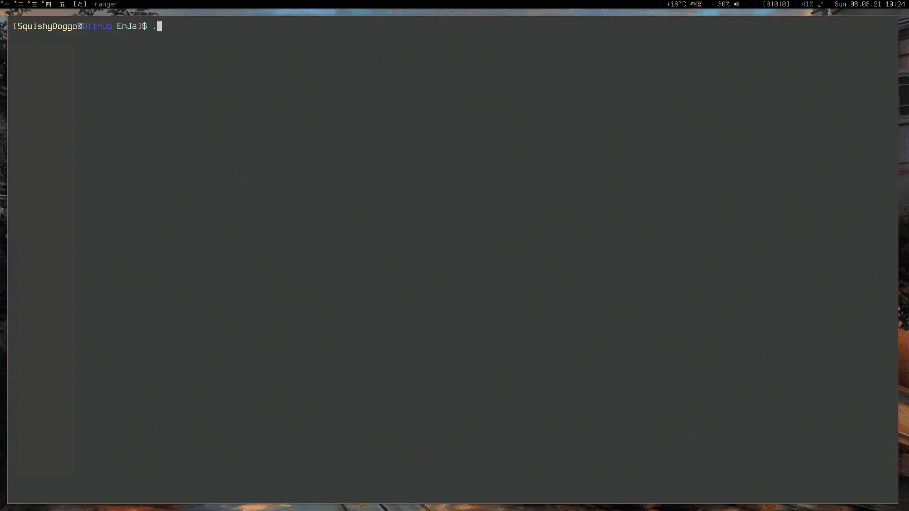

# EnJa #
Your friendly neighborhood cli vocabulary trainer for english and japanese.

## Installation ##
Currently __EnJa__ is only supported on GNU/Linux.\
Simply clone the repository and if not already present install a japanese font and input method.

## Compilation ##
If changes have been made to the source file _EnJa.pas_, use `fpc EnJa.pas` to recompile it. Naturally this assumes the _free pascal compiler_ [fpc](https://www.freepascal.org) is installed. 

## Usage ##
Run the executable in a terminal by specifying the full path, or with `./EnJa` inside the project directory, or just with `EnJa` after adding it to your `$PATH`.\
__EnJa__ scans _DictEnJa.txt_ for vocabulary, where words may be added in accordance with the notation used in the sample file.
When executed the user is presented 3 options:
1. __English -> Japanese__: Print english word and query the corresponding japanese word.
2. __Japanese -> English__: Print japanese word and query the corresponding english word.
3. __Mixed__: A random mix of 1 and 2.

## Showcase ##

## Dictionary File ##
Vocabulary inside the dictionary file is stored in 3-tuples and follows a preset structure.\
The first line contains the english word. If multiple english words point to the same japanese word they may be separated by semicolons. The japanese counterpart is stored in the line below. If it features kanji-characters, then the third line contains the pronunciation of the japanese word in hiragana. If it exists only of kana, the third line is left empty.

