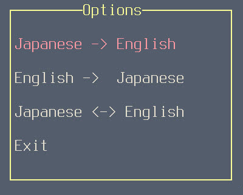

# :green_book: Cursary
Your friendly neighborhood ncurses vocabulary trainer for :us: and :jp:

## :computer: Installation
Clone the repository and run `make` inside the project directory.

## :ear: Explanation
__Cursary's__ interface is quickly understood. On startup :bearded_person: has the option to choose a query type.
Currently there are three:

:bearded_person: can navigate between them by using either the :arrow_up_down: keys or vim-type bindings.
After choosing a preferred option :bearded_person:'ll be greeted with the query screen:

The _query type_ field in the upper left corner displays the selected option. The _query_ field in the middle displays the current word which is to be translated.
Below is the _reply_ field that informs :bearded_person: if the input was correct or not. In this case the input was :x: so the vocabulary with its proper
translation is shown.
Located on the bottom is the _input_ field where user input is received.\
__Cursary__ keeps track of how many words :bearded_person: has been queried, how many of them he knew and their total amount.
These informations are displayed in the _statistics_ field. Here 27 of a total 71 words have been queried so far and :bearded_person: translated 6 of them correctly .\
:bearded_person: can always go back to the options screen by hitting ^C + o followed by enter.

## :eyes: Showcase

## :file_folder: Dictionary File
__Cursary__ scans _dicts/enja.txt_ for vocabulary, where words may be added in accordance with the notation :point_down:\
Vocabulary inside the dictionary file is stored in 3-tuples and follows a preset structure.
The first line contains the :us: word. If multiple :us: words point to the same :jp: word they may be separated by semicolons.\
The :jp: counterpart is stored in the line below. If it features kanji-characters, then the third line contains furigana.
If it exists only of kana, the third line is left empty.
