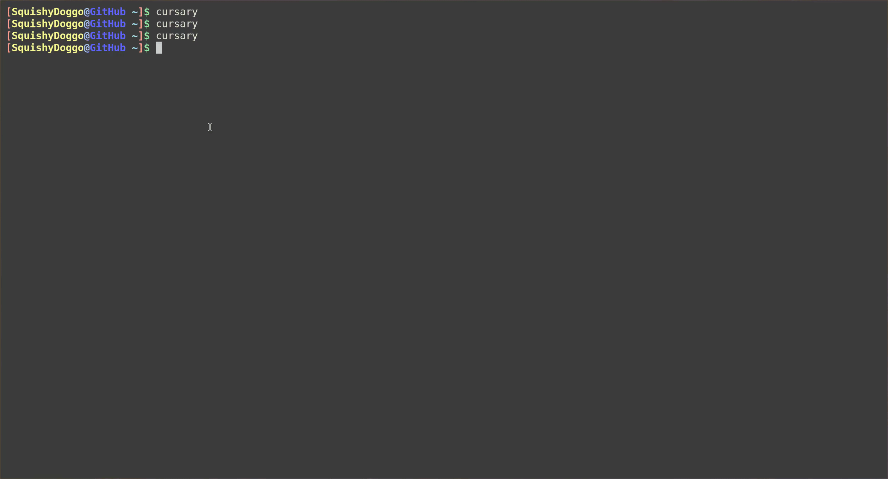

# Cursary
Your friendly neighborhood ncurses vocabulary trainer for :us: and :jp:

## :computer: Installation
Clone the repository and run `make` inside the project directory.\
Currently this only works on Linux. If you are using Mac or Windows run `g++ -lncurses /path/to/cursary.cc -o cursary`. 
Ncurses alongside a :jp: font and input method need to be installed.

## :ear: Guide
__Cursary__'s interface is quickly understood. On startup :curly_haired_man: has the option to choose a query type,
after which he will be greeted with the query screen:

The *query type* field in the upper left corner displays the selected option. The *query* field in the middle displays the current word which is to be translated.
Right below is the *reply* field that informs :curly_haired_man: whether the input was correct or not. In this case the input was :x: so the vocabulary with its proper
translation is shown.
Located on the bottom is the *input* field where user input is received.\
__Cursary__ keeps track of how many words have been queried, how many of them were known and their total amount.
These informations are displayed in the *statistics* field. Here 27 of a total 71 words have been queried so far and :curly_haired_man: translated 6 of them correctly.

During an active session, i.e. while vocabulary is being queried, the following key combinations are bound: 
| Key Bindings 	| 							|
| ------------- | -----------------------------------------------------	|
| `Ctrl+O` 	| Quits current session & goes back to start menu 	| 
| `Ctrl+N` 	| Clears the *input* field 				|
| `Ctrl+F` 	| Toggles furigana visibility if available  		|

## :eyes: Showcase

## :file_folder: Dictionary File
__Cursary__ scans _dicts/enja.txt_ for vocabulary, where words may be added in accordance with the notation :point_down:

Vocabulary inside the dictionary file is stored in 3-tuples and follows a preset structure.
The first line contains the :us: word. If multiple :us: words point to the same :jp: word they may be separated by semicolons.\
The :jp: counterpart is stored in the line below. If it features kanji-characters, then the third line contains furigana.
If it exists only of kana, the third line is left empty.
