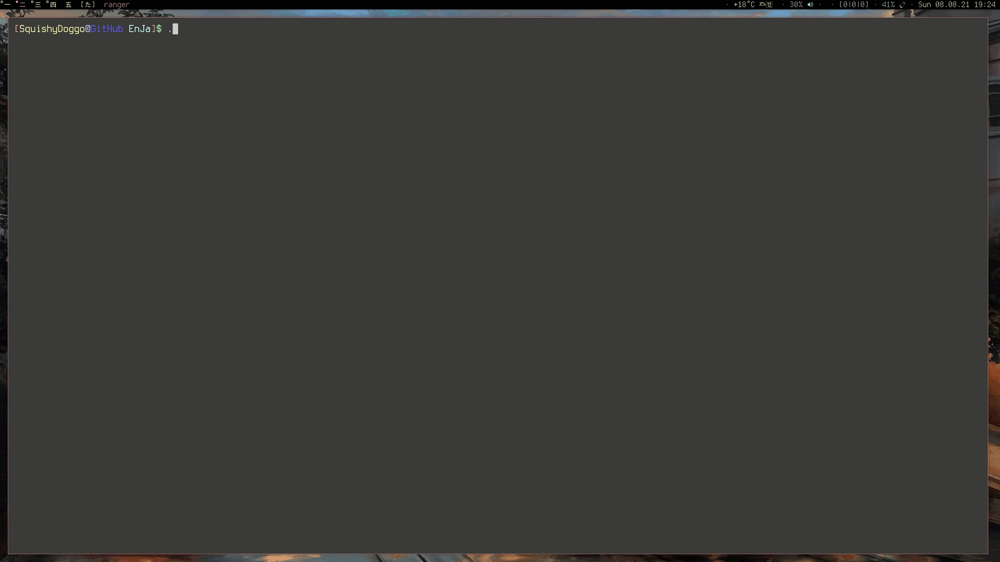

# EnJa #
Your friendly neighborhood cli vocabulary trainer for english and japanese.

## Installation ##
Clone the repository and run the __EnJa__ executable in a terminal.
If changes have been made to the source file _EnJa.pas_, use `fpc EnJa.pas` to recompile it. Naturally this assumes the _free pascal compiler_ [fpc](https://www.freepascal.org) is installed. 

## Usage ##
To be able to use __EnJa__ a japanese font and input method is required. All vocabulary is stored in _DictEnJa.txt_ and new words may be added in accordance with the notation used in the dictionary file.
When executed one can choose between three options:
1. __English -> Japanese__: Print english word and query the corresponding japanese word.
2. __Japanese -> English__: Print japanese word and query the corresponding english word.
3. __Mixed__: A random mix of 1 and 2.

## Dictionary File ##
Vocabulary inside the dictionary file is stored in 3-tuples and follows a preset structure. The first line contains the english word. If multiple english words point to the same japanese word they may be separated by semicolons. The japanese counterpart is stored in the line below. If it features kanji-characters, then the third line contains the pronunciation of the japanese word in hiragana. If it exists only of kana, the third line is left empty.

## Showcase ##

